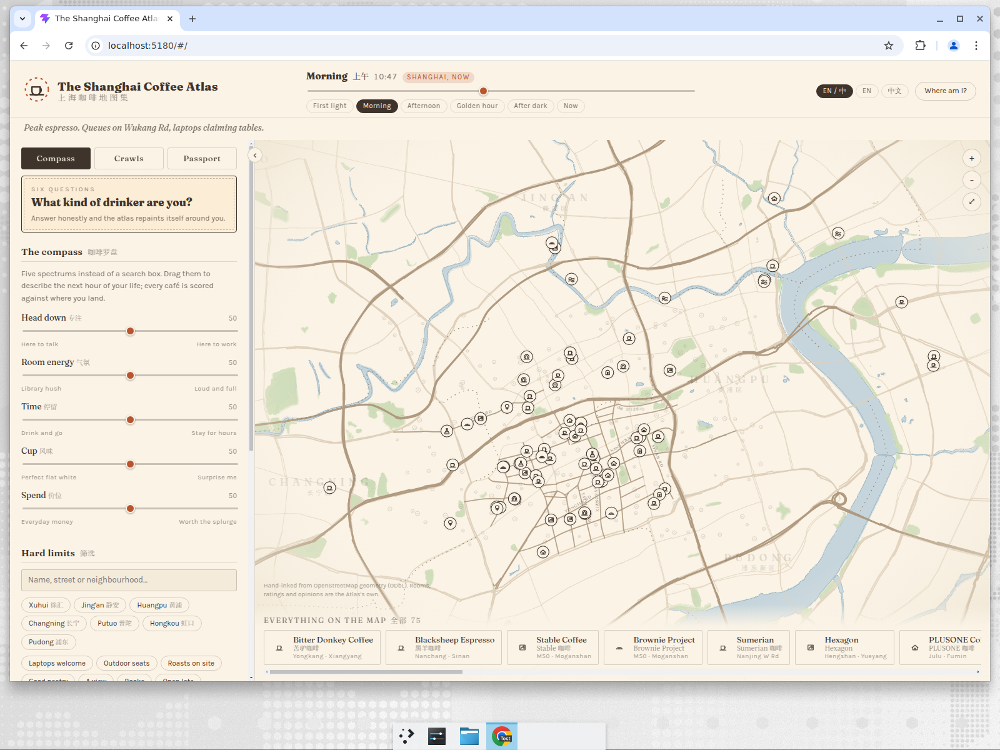

# The Shanghai Coffee Atlas · 上海咖啡地图集

Vibe-coded with Devin AI.

A hand-inked atlas of 75 Shanghai coffee rooms. Not a map app: there are no tiles, no
star ratings and no "nearest first" list. You describe the next hour of your life and the
sheet re-inks itself around you.



## Why it exists

Shanghai has more coffee shops than any city on earth, and every tool for finding one
answers the wrong question — *where is coffee* — when the real question is *what kind of
room do I want to be in for the next hour*. The Atlas answers that one.

## What is in it

- **The compass.** Five spectrums instead of a search box — head down ↔ here to talk,
  library hush ↔ loud and full, drink and go ↔ stay for hours, perfect flat white ↔
  surprise me, everyday money ↔ worth the splurge. Every café is scored against where you
  land, 0–100, with a plain-language verdict.
- **Six questions.** A quiz that reads your habits, names you (The Standing Drinker, The
  Lane Dweller, The Flavour Chaser…) and repaints the map from the answers.
- **Ten kinds of room.** Each café is drawn as a glyph for its archetype — a roasting drum,
  a keyhole for the hidden doors, a lane-house gate — so the sheet is legible before you tap
  anything.
- **Seven crawls.** Walking routes in running order (Under the Plane Trees, Nine Square
  Metres, Roasters' Row…), inked onto the map with per-leg walking minutes.
- **A passport.** Stamps, ten badges and a saved list, all in `localStorage` — no account,
  no server, nothing to sell.
- **Getting there in Chinese.** A taxi card with the Chinese name and address at
  billboard size, plus bilingual labels throughout.
- **Time of day.** Five palettes from first light to after dark; the sheet is lit for the
  hour you are actually in.
- **Shareable.** Café, crawl and compass state live in the URL hash.

## Running it

```bash
npm install
npm run dev      # http://localhost:5173
npm run build
npm run lint
```

## The data

Names, streets and coordinates come from OpenStreetMap and published Shanghai coffee
guides. The basemap — roads, lanes, parks, water, district outlines — is generated from
Overpass extracts by `tools/build_basemap.py` into `src/data/basemap.json`:

```bash
python3 tools/build_basemap.py
```

Geometry © OpenStreetMap contributors, ODbL.

**The archetypes, the five axes, the tags and every field note are the Atlas's own
editorial read** — they are opinions about rooms, not facts about businesses. Hours are
indicative; check before you walk.
